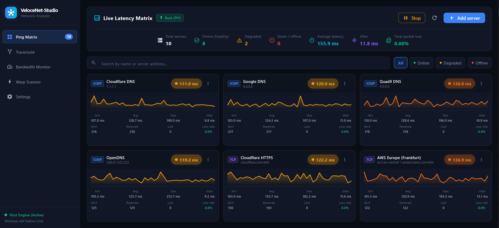
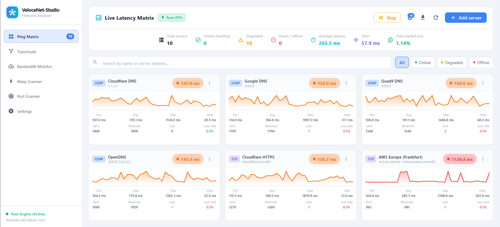
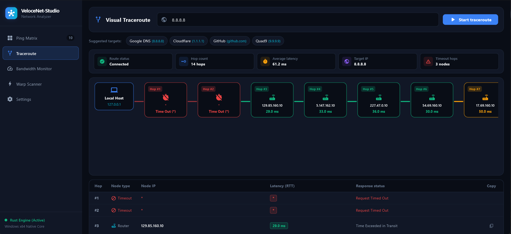
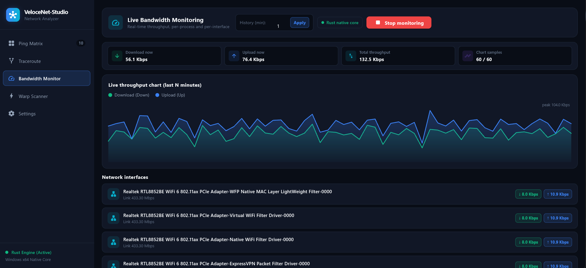
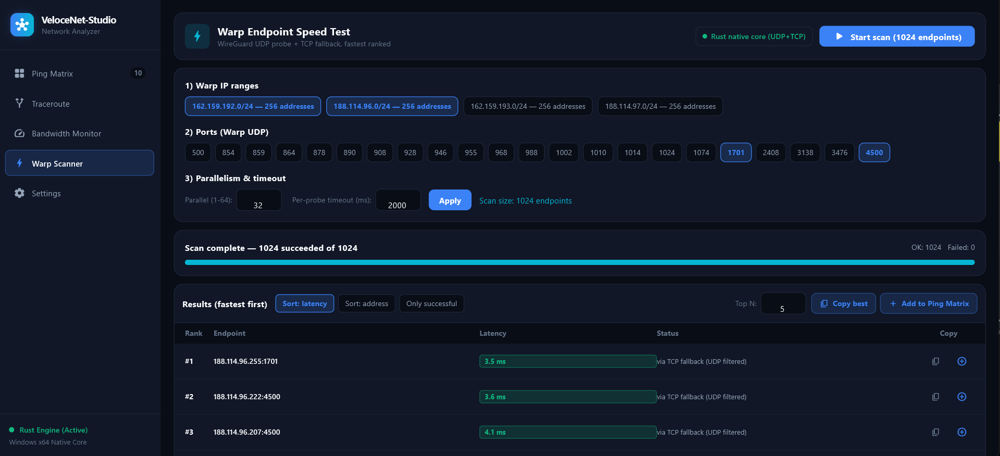
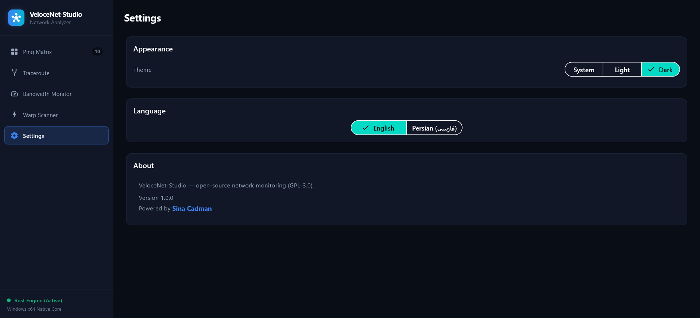
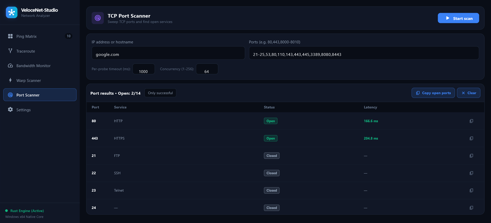
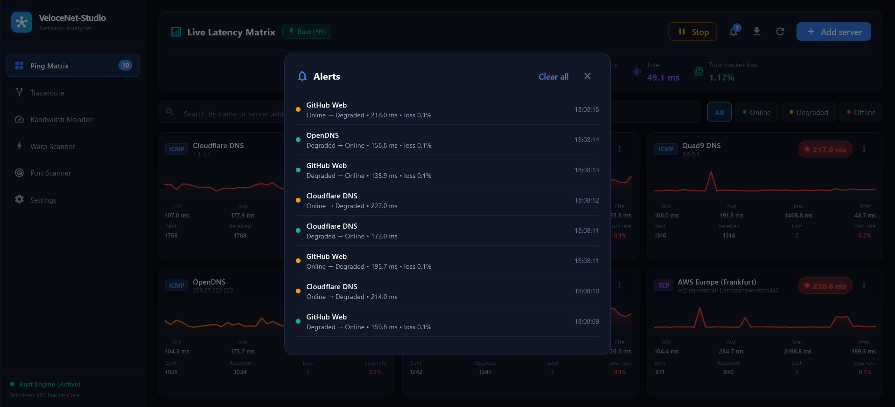
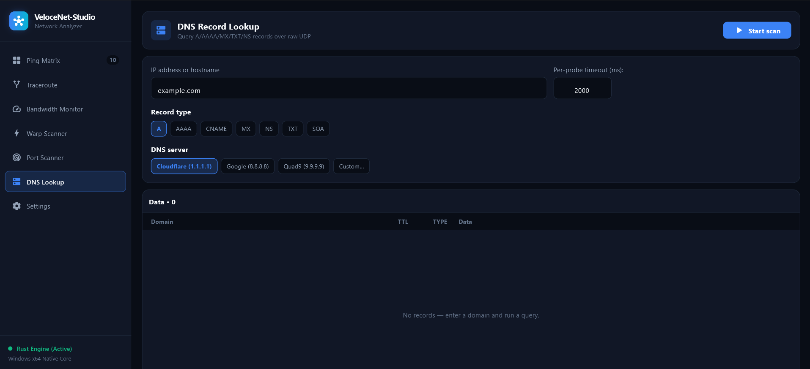

# VeloceNet-Studio

[](https://github.com/Cadman021/VeloceNet-Studio/actions/workflows/ci.yml)
[](https://github.com/Cadman021/VeloceNet-Studio/releases/tag/v1.1.0)
[](LICENSE)
[]()
[]()
[]()

Cross-platform **network monitoring and analysis studio** built with **Flutter** + a **Rust engine (Tokio, via FFI)**.

Live latency matrix (ICMP / TCP), visual traceroute, bandwidth monitor, Warp endpoint scanner, TCP port scanner and DNS lookup — with Light/Dark/System themes and English/فارسی/Русский/中文 UI.

> License: **GPL-3.0-or-later** — see [LICENSE](LICENSE).

## Screenshots

> Screenshots live in [`docs/screenshots/`](docs/screenshots/). If an image is missing below, capture it with <kbd>Win</kbd>+<kbd>Shift</kbd>+<kbd>S</kbd> at 1600×900 and save it under that path.

| Ping Matrix (dark) | Ping Matrix (light) |
|---|---|
|  |  |

| Traceroute | Bandwidth |
|---|---|
|  |  |

| Warp Scanner | Settings |
|---|---|
|  |  |

| Port Scanner | Alert log |
|---|---|
|  |  |

| DNS Lookup |
|---|
|  |

## Features

- **Ping Matrix** — concurrent ICMP (Windows IP Helper, no admin needed) + TCP-handshake probes, live sparklines, RTT avg/min/max, RFC 3550 jitter, loss %, status-change **alert log** with unread badge, one-click **CSV export**.
- **Traceroute** — TTL-based visual hop chain + data table (Windows native ICMP), IPv4/IPv6 parsing, averaged multi-sample RTT.
- **Bandwidth** — per-interface live deltas via `GetIfTable2` (64-bit counters), top processes by connection share (explicitly labeled *estimated*).
- **Warp Scanner** — WireGuard-style UDP probe + TCP fallback, ranking, copy-to-clipboard, one-click add to Ping Matrix.
- **Port Scanner** — TCP sweep with port-list specs (`80,443,8000-8010`), open/closed/filtered states, service guesses.
- **DNS Lookup** — raw UDP client for A/AAAA/MX/TXT/NS/CNAME/SOA records against Cloudflare/Google/Quad9 or a custom server, with NXDOMAIN distinction and query-time display.
- **Settings** — Light / Dark / System theme + English / فارسی / Русский / 中文 locale, persisted with `shared_preferences` (default: English).
- **Resilient engine** — if the Rust `.dll`/`.so` isn't built, the app automatically uses the Dart fallback prober so the UI stays usable.

## Download (v1.1.0)

No build needed — pick your platform from the
[v1.1.0 release](https://github.com/Cadman021/VeloceNet-Studio/releases/tag/v1.1.0):

| Platform | File | Run |
|---|---|---|
| Windows x64 | `velocenet-studio-windows-x64.zip` | Extract, run the `.exe` (DLL bundled next to it) |
| Linux x64 | `velocenet-studio-linux-x64.tar.gz` | Extract, run the `netstudio` binary (`.so` bundled next to it) |
| macOS arm64 | `velocenet-studio-macos-arm64.zip` | Extract, right-click the `.app` → Open (unsigned build, one-time Gatekeeper approval) |

Native ICMP probing is Windows-only for now; on Linux/macOS those probes transparently fall back to TCP. See [CHANGELOG.md](CHANGELOG.md) for what's in this release.

## Build from source (Windows)

Prerequisites: Flutter SDK ≥ 3.22 · Rust stable (`rustup`) · Windows 10/11 x64 for full native features.

```powershell
.\build_native.ps1      # cargo build --release + stage netstudio_engine.dll
flutter pub get
flutter run -d windows
```

Manual alternative:

```powershell
cd native_engine
cargo build --release
Copy-Item target\release\netstudio_engine.dll ..
cd ..
flutter run -d windows
```

Linux/macOS: `cargo build --release` produces `libnetstudio_engine.so` / `.dylib`; ICMP falls back to TCP where raw sockets aren't available.

## How it works

```
┌──────────── Flutter UI ────────────┐      ┌────────── Rust engine ──────────┐
│ Ping Matrix · Traceroute           │ JSON │ Tokio probers (ICMP/TCP/TTL)    │
│ Bandwidth · Warp · Portscan · DNS  │◄────►│ stats (RTT/jitter/loss)         │
│ SettingsController (theme+locale)  │  FFI │ traceroute / bandwidth / warp   │
└────────────────────────────────────┘      └─────────────────────────────────┘
```

- FFI boundary: `lib/core/ffi/` (Dart) ↔ `native_engine/src/ffi.rs` (C ABI). All strings are validated in Dart before crossing; numeric ranges are clamped on both sides.
- Native library is resolved from **absolute paths anchored at the running executable only** — never cwd/`PATH` (DLL-hijacking safe).
- State: `PingMatrixController`, `TracerouteController`, `BandwidthController`, `WarpController`, `SettingsController` (all `ChangeNotifier`-based).

## Project structure

```
lib/
  main.dart                      # async boot + SettingsController load
  core/ffi/                      # native_library.dart, native_bindings.dart
  core/theme/                    # app_colors.dart, app_theme.dart, theme_x.dart
  core/settings/                 # settings_controller.dart (theme+locale)
  core/i18n/                     # JSON-backed AppStrings (en/fa/ru/zh, default en)
  core/settings/                 # theme + locale controller (persisted)
  models/ services/ state/       # incl. alert_log.dart (status-change history)
  views/
    main_shell_view.dart         # sidebar + IndexedStack tabs
    ping_matrix/ traceroute/ bandwidth/ warp/ portscan/ dnslookup/ settings/
native_engine/src/
  engine.rs ffi.rs stats.rs probe/ traceroute.rs bandwidth.rs warp.rs
.github/workflows/              # ci.yml, release.yml
docs/screenshots/               # images used above
```

## Security notes

- No cwd/`PATH` DLL probing; missing engine → Dart fallback (never a crash).
- Warp scan input capped (256 KB / 4096 endpoints); IPv6 handled explicitly (bracketed `[::1]:port`).
- Per-process bandwidth is a **connection-share estimate** (Windows exposes no per-PID byte counters without ETW) — the UI labels it as such.

## Contributing

See [CONTRIBUTING.md](CONTRIBUTING.md). TL;DR:

```bash
flutter analyze --no-pub
flutter test --no-pub
cd native_engine && cargo test --release && cargo clippy --release -- -D warnings
```

New UI strings must go through the JSON dictionaries in `assets/lang/` (all four locales — `test/i18n_parity_test.dart` enforces it); new colors through `ThemeX`. Bug reports and feature requests use the issue templates.

## Changelog & roadmap

See [CHANGELOG.md](CHANGELOG.md). Near-term ideas: Linux/macOS native ICMP, Prometheus export endpoint, real per-process accounting (ETW), server-config import/export (JSON).
